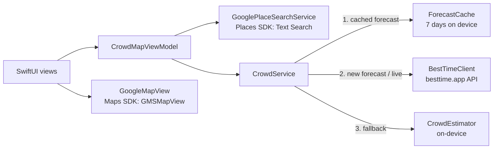

# Crowd Finder

**See how crowded a place is before you go.**

Crowd Finder is an iPhone app (Swift, SwiftUI) with a search bar and a Google map.
Search any place or city, and the map shows how busy each place is, with colored markers:

| Color | Level | Busyness | Advice |
|---|---|---|---|
| 🟢 Green | Quiet | 1–24 % | Great time to go |
| 🟡 Yellow | Moderate | 25–49 % | Good time to go |
| 🟠 Orange | Busy | 50–74 % | Expect a crowd |
| 🔴 Red | Very busy | 75 % + | Consider going later |

100 % means "as busy as this place's busiest hour in a normal week" (the same scale Google "Popular times" uses). Live values can go above 100 %.

---

## Features

- **Search bar**: search for a place (`Marina Beach`, `Eiffel Tower`) or a whole **city** (`Chennai`). For a city, the app shows the crowd at its popular places.
- **Google Map with crowd markers**: each pin shows the crowd %, colored by level, with a colored "crowd aura" circle that gets bigger when the place is busier.
- **Quick searches**: tourist spots, restaurants, cafés, malls, parks, beaches, places of worship, stations, gyms and hospitals, near you or inside the city you searched.
- **Time travel**: see the crowd **now**, or in +1 h, +2 h … +12 h.
- **Sort by least crowded** to find the quietest option quickly.
- **Place details**:
  - crowd gauge
  - a clear answer: *"Good time to go now"* or *"Better at 3 PM"*
  - a "Popular times" chart for every day of the week
  - live data compared with usual levels
  - the place's local time
  - Directions, Open in Google Maps, and Share
- **Honest data labels**: every number is marked **LIVE**, **FORECAST** or **ESTIMATE**.
- Works in light and dark mode, with VoiceOver labels.

---

## Important: where the crowd data comes from

The Google Maps app shows "Popular times" and "Live" busyness, but **Google does not give this data to developers**.
The official Places API (New) definition ([`place.proto`](https://github.com/googleapis/googleapis/blob/master/google/maps/places/v1/place.proto)) has no popular-times or busyness field.

So Crowd Finder uses:

| Part | Service | Required? |
|---|---|---|
| Map | [Google Maps SDK for iOS](https://github.com/googlemaps/ios-maps-sdk) 11.2 | Yes |
| Place search | [Google Places SDK for iOS](https://github.com/googlemaps/ios-places-sdk) 11.1 (Text Search, New) | Yes (same Google key) |
| Real crowd data | [BestTime.app](https://besttime.app) foot-traffic API: weekly forecasts and live busyness | Optional |
| Fallback | On-device **estimate** from typical patterns | Built in |

The app always picks the best source available for each place:

1. **LIVE**: BestTime live busyness right now. Loaded when you open a place.
2. **FORECAST**: BestTime's forecast for this hour, based on historical foot traffic. Saved on the device for 7 days.
3. **ESTIMATE**: used when there is no BestTime key, no data for the venue, or no network. It uses:
   - the typical daily pattern for the type of place (for example, restaurants peak at lunch and dinner, and stations peak at rush hour),
   - the day of the week,
   - the place's popularity (number of Google reviews),
   - the place's **local** time.

   Estimates are clearly labelled. They are a guide, not a measurement.

---

## Requirements

- A Mac with **Xcode 16 or later** (the Google Maps SDK requires Xcode 16+).
- An iPhone or Simulator on **iOS 17 or later**.
- A **Google Cloud** project with billing enabled.
- *(Optional)* A **BestTime.app** account for real foot-traffic data.

---

## Setup (about 10 minutes)

### 1. Get the code

```bash
git clone https://github.com/istalin2020/Crowd-Finder.git
cd Crowd-Finder
```

### 2. Create a Google Maps Platform API key

1. Open [Google Cloud Console](https://console.cloud.google.com/) and create or select a project with billing enabled.
2. Go to **APIs & Services → Library** and enable:
   - **Maps SDK for iOS**
   - **Places API (New)**
3. Go to **APIs & Services → Credentials → Create credentials → API key**.
4. Recommended: restrict the key.
   - **Application restrictions**: *iOS apps*, then add your bundle ID (see step 4).
   - **API restrictions**: *Maps SDK for iOS* and *Places API (New)*.

### 3. (Optional) Get a BestTime key

Create an account at [besttime.app](https://besttime.app) and copy your **private** API key (it starts with `pri_`).
You can skip this step. The app then shows estimates, and you can add the key later in the app's **Settings** screen.

### 4. Add your keys

```bash
cp Config/Secrets.example.xcconfig Config/Secrets.xcconfig
```

Then edit `Config/Secrets.xcconfig`:

```
GOOGLE_MAPS_API_KEY = AIza...your key...
BESTTIME_API_KEY_PRIVATE = pri_...your key...        (optional)
DEVELOPMENT_TEAM = ABCDE12345                        (optional, your Apple Team ID)
PRODUCT_BUNDLE_IDENTIFIER = com.yourname.CrowdFinder (use the same ID in the Google key restriction)
```

`Secrets.xcconfig` is git-ignored, so your keys are never committed.

### 5. Run

1. Open **`CrowdFinder.xcodeproj`** in Xcode.
2. Wait for Xcode to download the Swift packages (Google Maps and Google Places). The first time takes a few minutes.
3. Select your team in **Signing & Capabilities** (only needed on a real iPhone).
4. Choose an iPhone simulator or your device and press **⌘R**.

Run the unit tests with **⌘U**.

---

## How to use

1. Type a place or a city in the search bar, or tap a quick-search chip.
2. Look at the colored markers. Green is quiet and red is very busy.
3. Use **Now / +1h / +2h …** to see how the crowd changes later today.
4. Tap a marker or card for details and the go-now / go-later advice.
5. Tap **Directions** to go.

---

## Project structure

```
Crowd-Finder/
├── CrowdFinder.xcodeproj           Xcode project (Swift Package Manager dependencies)
├── Config/
│   ├── CrowdFinder.xcconfig        Build settings (no secrets)
│   ├── Secrets.example.xcconfig    Template for your API keys
│   └── Info.plist                  Passes the keys to the app
├── CrowdFinder/
│   ├── App/                        App entry point, configuration, Keychain
│   ├── Core/                       Platform-independent logic (unit tested)
│   │   ├── Models/                 Place, CrowdLevel, CrowdReport, WeeklyForecast, PlaceCategory
│   │   ├── Crowd/                  BestTimeClient, CrowdService, CrowdEstimator, ForecastCache, VisitAdvice
│   │   └── Utilities/              PlaceClock (place-local time), HourFormatter
│   ├── Services/                   Google Places search, location
│   ├── ViewModels/                 CrowdMapViewModel
│   ├── Views/                      SwiftUI screens: map, search, cards, detail, settings
│   └── Resources/                  App icon and colors
└── CrowdFinderTests/               Unit tests (XCTest)
```

### Architecture



- **MVVM** with `@Observable` (iOS 17).
- `CrowdService` is an `actor`. It merges duplicate requests, caches forecasts, and never fails: it falls back to an estimate.
- All times use the **place's local time zone**, so checking Paris from Chennai uses the Paris hour.
- BestTime details handled correctly:
  - each day runs **6 AM → 5 AM** the next morning,
  - `day_int` 0 is Monday,
  - live values can be above 100 %,
  - `+` signs in addresses are encoded.

---

## Costs and credits

- **Google**: map loads and Places Text Search are billed by Google Maps Platform. See the [official pricing](https://mapsplatform.google.com/pricing/).
  - The app requests only the fields it needs.
  - `rating` and `userRatingsTotal` (used as a popularity signal) put Text Search in a higher billing tier. To use the cheaper tier, remove them in `Services/PlaceSearchService.swift`. Estimates then use a default popularity.
- **BestTime**: each *new* venue forecast uses credits. To save credits:
  - only the top results of a search load real data automatically (8 by default; change it in **Settings → Credit saver**),
  - forecasts are cached for 7 days,
  - venues without data are remembered for 12 hours, so the app does not ask again.

## Security notes

- Restrict your Google key to your bundle ID and the two APIs.
- A BestTime key entered in the app is stored in the **iOS Keychain**.
- For a public App Store release, don't ship a BestTime *private* key inside the app. Send BestTime requests through your own small server instead.

---

## Troubleshooting

| Problem | Fix |
|---|---|
| "Add your Google Maps API key" screen | `Config/Secrets.xcconfig` is missing or still has the placeholder. Fix it, then clean and build (⇧⌘K, ⌘R). |
| Map is blank or grey | Enable **Maps SDK for iOS**, and check that the key's iOS restriction uses the same bundle ID as the app. |
| Search says the key is not authorized | Enable **Places API (New)** for the same key. |
| Every place shows ESTIMATE | Add a BestTime key (Settings), or check the warning banner. It shows problems such as a wrong key or no credits. |
| Swift packages fail to download | Xcode → File → Packages → **Reset Package Caches**. |

---

## Testing

- The `CrowdFinderTests` target has **46 unit tests**. They cover:
  - crowd levels and categories,
  - the BestTime 6 AM day window, JSON parsing and error handling (with a stubbed network),
  - cache and fallback behaviour,
  - live vs usual crowd,
  - estimator patterns,
  - time zones,
  - go-now / go-later advice,
  - Google Maps links.
- The platform-independent `Core` code also compiles in **Swift 6 strict-concurrency mode**.

---

## Sources

- Google Maps SDK for iOS: Swift package and requirements. <https://github.com/googlemaps/ios-maps-sdk>
- Google Places SDK for iOS: Swift package. <https://github.com/googlemaps/ios-places-sdk>
- Official Google samples (SwiftUI map wrapper, Text Search). <https://github.com/googlemaps-samples/maps-sdk-for-ios-samples>
- Places API (New) definitions. <https://github.com/googleapis/googleapis/tree/master/google/maps/places/v1>
- Google Maps Platform security guidance. <https://developers.google.com/maps/api-security-best-practices>
- Google Maps URLs. <https://developers.google.com/maps/documentation/urls/get-started>
- BestTime API reference. <https://documentation.besttime.app>
- BestTime official examples. <https://github.com/besttime-app/examples>
